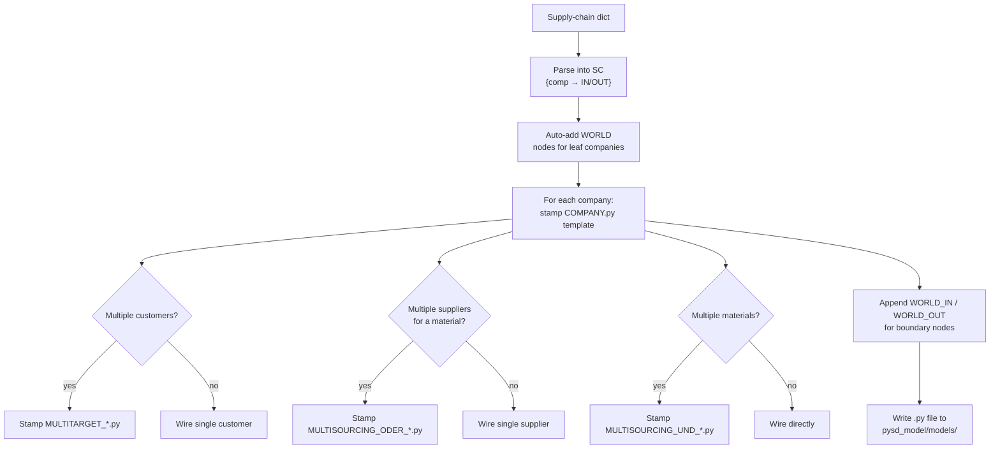
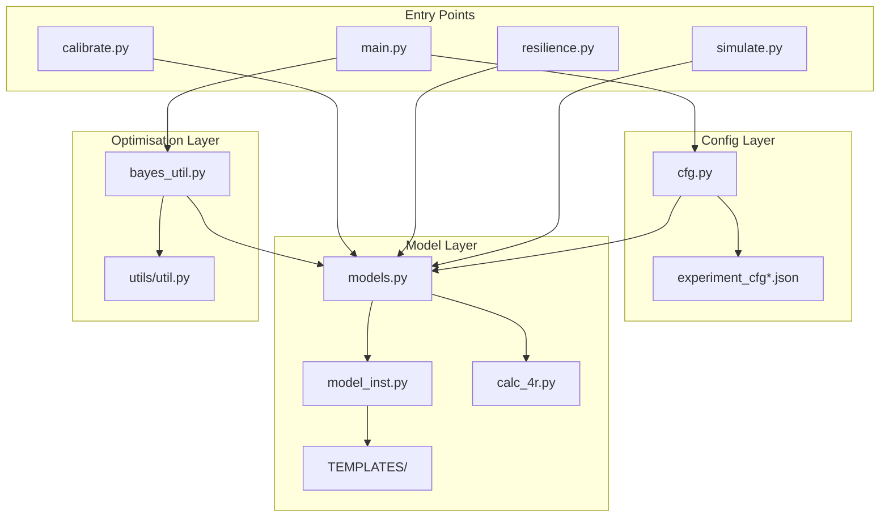

# Supply Chain Simulation & Optimization — Walkthrough

## 1. Introduction

### What
This repository implements a **supply chain simulation** built on the [PySD](https://pysd.readthedocs.io/) System Dynamics engine. PySD is not yet highly performant, but active development is expected to improve execution speed in future releases. The project supports two main objectives:

| Goal | Description |
|---|---|
| **Calibration** | Tune model parameters so that simulated *Wareneingang* (goods-in) and *Warenausgang* (goods-out) match real historical data |
| **Resilience Optimisation** | Inject supply-chain disruptions and maximise a *resilience score* decomposed into the **4 R's** — Robustness, Redundancy, Resourcefulness, Rapidity |


### How — Optimisation Pipeline

The system supports two optimisation backends, selectable via the `"optimizer"` config field:

**Option A: TPE + Bayesian GP** (`"optimizer": "tpe_bayes"` — default)

```
┌──────────────┐    ┌─────────────┐    ┌──────────────┐    ┌──────────────┐    ┌────────────┐    ┌──────────────┐    ┌────────────┐
│  Experiment  │───▶│   cfg.py    │───▶│   main.py    │───▶│  Phase 1:    │───▶│ Parameter  │───▶│  Phase 2:    │───▶│ Best Params│
│ Config (JSON)│    │resolve objs │    │ Optimisation │    │ TPE (Optuna) │    │ Importance │    │ Bayesian GP  │    │   (JSON)   │
└──────────────┘    └─────────────┘    └──────────────┘    └──────────────┘    └────────────┘    └──────────────┘    └────────────┘
```

1. **Phase 1 — TPE** (Tree-structured Parzen Estimator via *Optuna*): broad, multivariate search over the full parameter space.
2. **Optional pruning**: after TPE, use Optuna's ANOVA-based importance ranking to drop low-impact parameters.
3. **Phase 2 — Bayesian Optimisation** (Gaussian Process via *bayesian-optimization*): fine-tune top parameters seeded with the best TPE trials.

**Option B: PyGAD Genetic Algorithm** (`"optimizer": "pygad"`)

```
┌──────────────┐    ┌─────────────┐    ┌──────────────┐    ┌──────────────┐    ┌────────────┐
│  Experiment  │───▶│   cfg.py    │───▶│   main.py    │───▶│   PyGAD      │───▶│ Best Params│
│ Config (JSON)│    │resolve objs │    │ Optimisation │    │ Genetic Alg. │    │   (JSON)   │
└──────────────┘    └─────────────┘    └──────────────┘    └──────────────┘    └────────────┘
```

Single-phase evolutionary search using population-based crossover and mutation.

### Key Libraries

| Library | Role |
|---|---|
| `pysd 3.14.3` | System Dynamics simulation engine |
| `optuna 4.7.0` | TPE sampler for Phase 1 |
| `bayesian-optimization 1.5.1` | Gaussian-process optimiser for Phase 2 |
| `tensorboardX` | Live loss tracking via TensorBoard |
| `scipy` | L-BFGS-B curve fitting (4 R's calculation) |
| `networkx` + `matplotlib` | Supply-chain graph visualisation |
| `pygad` | Genetic algorithm optimiser (alternative to TPE+Bayesian) |

---

## 2. Supply Chain Instantiation & Template System

### 2.1 Defining a supply chain

A supply chain is described as a **nested dict** mapping each company to its input materials and their suppliers:

```json
{
    "MQ": {
        "Holz": ["Lieferant", "Anderer"],
        "Eisen": ["EisenLieferant"]
    },
    "Lieferant": {
        "Holz": ["Anderer"]
    }
}
```

`"WORLD"` is a special keyword to mark external market boundaries (auto-generated).

### 2.2 Template stitching — `create_model()`

The function `create_model()` in `model_inst.py` performs the following steps:



**Placeholder substitution**: Every template uses `_PLACEHOLDER` suffixes which are replaced with actual company/supplier names at generation time (e.g. `_PLACEHOLDER` → `_MQ`).

### 2.3 Templates overview

| Template | Purpose |
|---|---|
| `MODEL.py` | PySD boilerplate: control variables (time, time-step, saveper), `DelayedValueQueue`, `f_osci` helper |
| `COMPANY.py` | Full single-company model: 12+ stocks (Eingangslager, production pipeline, shipping pipeline, accumulators), flows, parameters for delays/limits/flexibility, and `TODO_*` / `DEPEND_*` placeholders for interface wiring |
| `WORLD_IN.py` | Boundary node: external market *demand* entering a leaf company (Marktnachfrage, Nachfrage tracking) |
| `WORLD_OUT.py` | Boundary node: external market *supply* feeding a leaf company |
| `MULTISOURCING_ODER_*.py` | OR-style multi-sourcing: split orders across multiple suppliers (with `Anteil_*` parameters) |
| `MULTISOURCING_UND_*.py` | AND-style multi-sourcing: combine materials that are all required (min over all streams) |
| `MULTITARGET_*.py` | Multi-customer: distribute outgoing shipments across multiple customer companies |

### 2.4 Extending the supply chain

To add more companies or materials to the supply chain:

1. **Edit the `SC` / `supply_chain` dict** in the experiment config JSON (or `default_sim_config.json`) — add new company entries and list their material inputs and suppliers. To simplify the process of adding "Anteil" and "Multiplikator" for each Supplier and Item, respectively, the script `pysd_model/generate_params.py` in combination with `pysd_model/example_sc_config_nested.json` can be used.
2. **No template changes required** for standard topologies. The `create_model()` function handles arbitrary multi-sourcing, multi-target, and multi-material configurations automatically.
3. **For new flow types**, create a new template file in `TEMPLATES/`, following the pattern: use `_PLACEHOLDER` and `_PLACEHOLDER1` for company/supplier names, and `TODO_*` / `DEPEND_*` for interface wiring points.

---

## 3. Running the System

### 3.1 Entry Point: `main.py` — Full Optimisation

```bash
# Calibration with TPE + Bayesian (default)
python main.py -c experiment_cfg_calibrate.json

# Resilience optimisation
python main.py -c experiment_cfg_resilience.json

# Calibration with PyGAD genetic algorithm
python main.py -c experiment_cfg_pygad.json

# Override config values from CLI (dot notation for nested keys)
python main.py -c experiment_cfg_calibrate.json bayes_tpe_params.num_iter_tpe_per_param 500
```

**What happens:**

1. Loads the experiment JSON → `cfg.py::load_experiment_config()` resolves string names like `"SimInstancePySDCalibration"` to classes, `"pysd_calibrate"` to loss functions, expands `TUNE_PARAMS` per-company, and optionally filters by `optimizable_params`.
2. Creates timestamped output folder under `out/`.
3. Sets up `OptimizationWrapper` — wraps the simulation model as a callable objective.
4. Dispatches to the selected optimizer based on `"optimizer"` field (default: `"tpe_bayes"`).
5. Saves results: `final_params.json`, TensorBoard events, `al_opt.json` (raw logs), `al_opt_transformed.csv`.

### 3.2 Experiment config fields & tunable parameters

#### Config fields

The experiment config JSON is organised into **groups**. CLI overrides use dot notation (e.g. `optimization.name my_run`).

**`sim_config`** — simulation topology

| Field | Example | Purpose |
|---|---|---|
| `sc` | `{"MQ": {"Alles": ["Lieferant"]}}` | Supply chain topology |
| `target_company` | `"MQ"` | Target company (from `sc`), used in losses |
| `disruption` | `"MA_Knappheit"` or `null` | Named disruption from `DISRUPTIONS` dict |

**`data`** — input data

| Field | Example | Purpose |
|---|---|---|
| `data_path` | `"pysd_model/data/MQ.xlsx"` | Path to real logistics data |
| `data_map` | `{"geschätzte verteilung...": "Marktnachfrage_WORLD_MQ", ...}` | Column-to-node mapping |

**`optimization`** — optimizer settings

| Field | Example | Purpose |
|---|---|---|
| `sim_type` | `"SimInstancePySDCalibration"` | Model class (from `cfg.py::SIM_TYPES`) |
| `loss_fn` | `"pysd_calibrate"` | Loss function (from `cfg.py::LOSS_FNS`) |
| `optimizer` | `"tpe_bayes"` or `"pygad"` | Which optimizer to use |
| `optimizable_params` | `["LagerLimit", "ProductionLimit"]` | Substring filter — only tune matching params |
| `out_path` | `"out"` | Output directory |
| `in_path` | `""` | Prior optimisation log (to resume) |
| `name` | `"bayes"` | Suffix for output folder name |
| `num_threads` | `1` | Parallel simulation instances |
| `default_params` | `"cfg_default_pysd.json"` | Initial/calibrated parameter values |

**`bayes_tpe_params`** — TPE + Bayesian GP settings

| Field | Default | Purpose |
|---|---|---|
| `num_iter_tpe_per_param` | `100` | TPE iterations per tunable parameter |
| `param_importance_threshold` | `1` | Set < 1 to prune unimportant params after TPE |
| `num_iter_bayes_per_param` | `50` | Bayesian GP iterations per tunable parameter |

**`pygad_params`** — genetic algorithm settings

| Field | Default | Purpose |
|---|---|---|
| `num_generations` | `200` | Number of GA generations |
| `sol_per_pop` | `50` | Population size per generation |
| `num_parents_mating` | `sol_per_pop/2` | Parents for mating (clamped to ≤ sol_per_pop) |
| `crossover_type` | `"single_point"` | Crossover method |
| `mutation_type` | `"random"` | Mutation method |
| `mutation_percent_genes` | `10` | % of genes mutated per offspring |

**`anylogic_config`** — legacy AnyLogic wrapper

| Field | Example | Purpose |
|---|---|---|
| `model_path` | `"model.jar"` | Path to model jar |
| `java_path` | `"java.exe"` | Path to Java executable |

#### Tunable parameters (per company)

Each parameter below is expanded per company in the supply chain (e.g. `MaterialOrderDelay_MQ`, `MaterialOrderDelay_Lieferant`). Defined in `TUNE_PARAMS_BASE` inside `cfg.py`:

| Parameter | Type | Bounds | Description |
|---|---|---|---|
| `MaterialOrderDelay` | float | [0.1, 0.9] | Speed at which material orders adjust towards target |
| `ProductionDelay` | float | [0.1, 0.9] | Speed at which production rate adjusts towards target |
| `readytoshipDelay` | float | [0.1, 0.9] | Speed at which shipping rate adjusts |
| `LagerLimit` | int | [10 000, 300 000] | Maximum input warehouse capacity |
| `CoverageLimit` | int | [1 000, 30 000] | Maximum shipping/coverage capacity |
| `ProductionLimit` | int | [1 000, 30 000] | Maximum production rate |
| `LimitfinishedInventory` | int | [10 000, 300 000] | Maximum finished-goods inventory |
| `Sicherheitsbestand` | int | [0, 100 000] | Safety stock level |
| `delayTimeShipping_amp` | float | [0.1, 7.0] | Shipping delay oscillation amplitude |
| `delayTimeShipping_freq` | float | [0.01, 1.0] | Shipping delay oscillation frequency |
| `delayTimeShipping_shift` | float | [0.0, 30.0] | Shipping delay oscillation phase shift |
| `delayTimeShipping_offset` | float | [1.0, 30.0] | Shipping delay oscillation baseline |
| `MA_Flex_amp` | float | [0.1, 0.9] | Workforce flexibility oscillation amplitude |
| `MA_Flex_freq` | float | [0.01, 1.0] | Workforce flexibility oscillation frequency |
| `MA_Flex_shift` | float | [0.0, 30.0] | Workforce flexibility oscillation phase shift |
| `MA_Flex_offset` | float | [0.1, 0.9] | Workforce flexibility oscillation baseline |
| `delayTimeProduction_amp` | float | [0.1, 7.0] | Production delay oscillation amplitude |
| `delayTimeProduction_freq` | float | [0.01, 1.0] | Production delay oscillation frequency |
| `delayTimeProduction_shift` | float | [0.0, 30.0] | Production delay oscillation phase shift |
| `delayTimeProduction_offset` | float | [1.0, 30.0] | Production delay oscillation baseline |
| `TotalCustomerOrder_start` | int | [0, 300 000] | Initial total customer orders (start condition) |
| `Eingangslager_start` | int | [0, 100 000] | Initial input warehouse level (start condition) |

**For multi-sourcing, an additional `Anteil_<Company>_<Supplier>` parameter (float, [0.0, 1.0]) is generated per supplier share.**

### 3.3 Standalone Scripts (Testing & Visualisation)

These scripts live in `pysd_model/` and use `default_sim_config.json` by default. Run them from the `pysd_model/` directory:

#### `simulate.py` — Run & visualise

```bash
cd pysd_model
python simulate.py
python simulate.py -c default_sim_config.json --noplot
```

- Instantiates `SCModel`, runs the simulation, optionally draws the supply-chain graph and plots rates (Lieferungsrate, Marktnachfrage, orders, shipments).

#### `calibrate.py` — Test calibration quality

```bash
cd pysd_model
python calibrate.py
python calibrate.py -c default_sim_config.json default_params "path/to/optimised_params.json"
```

- Uses `CalibrationModel` with the 95th-percentile error metric.
- Plots simulated vs. real *EingangslagerAccum* and *TotalShipped* alongside the real data.

#### `resilience.py` — Test disruption response

```bash
cd pysd_model
python resilience.py
python resilience.py -c default_sim_config.json disruption_type "Erdbeben"
```

- Uses `ResilienceModel` with a chosen disruption type (defaults to `"VariableDisruption"`).
- Plots incoming/outgoing flows for the target company and productivity curves (actual, real-data-based, and the fitted disruption/recovery sigmoids).

### 3.4 Available disruption scenarios

| Name | Affected Parameters | Duration (days) |
|---|---|---|
| `MA_Knappheit` | MA flexibility, coverage, production limits | 14 |
| `Grenzschließung` | Coverage limit | 10 |
| `Containershortage` | Ready-to-ship delay, coverage | 21 |
| `Wintersturm` | MA flexibility, coverage, production | 15 |
| `Lagertechnik` | Warehouse limit, production | 15–20 |
| `Erdbeben` | 8 parameters, 3-phase recovery | 50+ |
| `Hacker` | Material order delay, warehouse | 60 |
| `VariableDisruption` | 7 parameters, randomised timing & severity | Variable |

#### How to implement a new disruption

All disruptions are defined in the `DISRUPTIONS` dict inside `cfg.py` (`models.py`). Each entry maps a **company name** to a dict of **parameter overrides** that describe a time-dependent disturbance.

**Step 1** — Add a new entry to `DISRUPTIONS` in `pysd_model/models.py`:

```python
DISRUPTIONS = {
    # ... existing disruptions ...

    "MyNewDisruption": {
        # Which company is affected
        "Lieferant": {
            # Parameter to disturb
            "ProductionLimit": {
                # span: [disruption_start_day, disruption_end_day]
                "span": [120, 140],
                # goals: list of lambda functions applied to the parameter's initial value
                #   goals[0] = value during disruption (e.g. reduce to 20%)
                #   goals[1] = value after recovery  (typically restore: lambda x: x)
                "goals": [lambda x: x * 0.2, lambda x: x]
            },
            # You can affect multiple parameters simultaneously
            "CoverageLimit": {
                "span": [120, 150],  # longer recovery for this param
                "goals": [lambda x: x * 0.5, lambda x: x]
            }
        },
        # You can also affect multiple companies
        # "MQ": { ... }
    },
}
```

**Key rules:**
- `"span"` takes 2 values `[start, end]` for a simple disruption/recovery, or 3+ values `[start, mid, ..., end]` for multi-phase events (like the `Erdbeben` scenario).
- `"goals"` must have exactly `len(span) - 1` entries. Each is a `lambda x:` that receives the parameter's initial (calibrated) value and returns the target during that phase.
- Use `lambda` functions (not plain values) so the span can be callables too — for randomised disruptions, set span entries to `lambda: int(np.random.rand() * 20 + 90)`.

**Step 2** — Reference it in the experiment config JSON:

```json
{
    "DISRUPTION": "MyNewDisruption"
}
```

**Step 3** — Run the resilience optimisation or standalone test:

```bash
python main.py -c experiment_cfg_resilience.json
# or
cd pysd_model && python resilience.py -c default_sim_config.json disruption_type "MyNewDisruption"
```

### 3.5 The 4 R's — Resilience Score

After a disruption, `calc_4r.py` fits the productivity curve to a **double-sigmoid** model `f(x) = disruption_sigmoid + recovery_sigmoid`, then extracts:

| R | Meaning | Calculation |
|---|---|---|
| **Robustness** | How *slowly* productivity drops | `(-b_d / 4) / (c_d - from)` — slope ÷ onset time |
| **Redundancy** | How *high* the minimum stays | `1 − min(productivity)` |
| **Resourcefulness** | How effectively recovery begins | `(c_r − from) / (b_r / 4) / 1000` |
| **Rapidity** | How *quickly* full recovery happens | `X2 − X1` (time between 95 % disruption and 95 % recovery) |

The default resilience loss is: `Robustness + Resourcefulness + 50 × Redundancy + Rapidity`.

---

## 4. Executive Summary

This repository delivers an end-to-end pipeline for **supply chain modelling, calibration, and resilience analysis**:

- A **template-based code generator** dynamically constructs arbitrarily complex PySD System Dynamics models from a simple supply-chain dictionary — supporting multi-sourcing, multi-material, and multi-customer topologies out of the box.
- **Calibration** aligns the simulation to real logistics data (Wareneingang/Warenausgang) using a two-phase optimisation pipeline (TPE → Gaussian-Process Bayesian optimisation) with automatic parameter importance pruning.
- **Resilience optimisation** stress-tests the model against predefined disruption scenarios and maximises a composite score based on the **4 R's of resilience** (Robustness, Redundancy, Resourcefulness, Rapidity).
- Standalone scripts (`simulate.py`, `calibrate.py`, `resilience.py`) allow quick testing, visualisation, and validation of results using the outputs of the optimisation runs.
- All results are logged to **TensorBoard**, CSV, and JSON for full traceability and reproducibility.

---

## 5. Repository Structure & Core Components

```
simulation_rl/
├── main.py                         # 🔑 Entry point — runs full optimisation
├── cfg.py                          # Configuration loader & registry
├── experiment_cfg*.json            # Experiment presets (calibration / resilience / pygad)
├── experiment_cfg_pygad.json       # 🧬 PyGAD genetic algorithm preset
├── cfg_default_pysd.json           # Default (calibrated) parameter values
│
├── pysd_model/                     # 📦 PySD model package
│   ├── models.py                   # SCModel, CalibrationModel, ResilienceModel
│   ├── calibrate.py                # 🔑 Standalone calibration script
│   ├── resilience.py               # 🔑 Standalone resilience script
│   ├── simulate.py                 # 🔑 Standalone simulation script
│   ├── default_sim_config.json     # Config for standalone scripts
│   ├── data/
│   │   ├── MQ.xlsx                 # Real logistics data (Wareneingang/-ausgang)
│   │   └── params.txt              # Tab-separated default parameters
│   ├── TEMPLATES/                  # 🧩 PySD code templates (see §2)
│   │   ├── MODEL.py                # Global model header (time, control vars)
│   │   ├── COMPANY.py              # Single-company template (~630 lines)
│   │   ├── WORLD_IN.py / WORLD_OUT.py
│   │   ├── MULTISOURCING_*.py      # AND / OR multi-supplier templates
│   │   └── MULTITARGET_*.py        # Multi-customer templates
│   ├── models/                     # Generated .py models (runtime artefact)
│   └── util/
│       ├── model_inst.py           # Template stitcher & SDModel class
│       ├── calc_4r.py              # 4 R's curve fitting (sigmoid decomposition)
│       └── cfg_util.py             # CLI arg merging (detectron2-style)
│
├── utils/                          # 🛠  Optimisation utilities
│   ├── bayes_util.py               # OptimizationWrapper, loggers, bridges
│   ├── util.py                     # ParamTransform, dict recursion helpers
│   ├── al_sims.py                  # AnyLogic simulation backends
│   └── constants.py                # Separator strings (//, ##)
│
├── out/                            # Timestamped output folders
└── requirements.txt
```

### How the files relate



### Key classes at a glance

| Class | File | Purpose |
|---|---|---|
| `SCModel` | `models.py` | Base: instantiate PySD model from a supply-chain dict and run it |
| `CalibrationModel` | `models.py` | Extends `SCModel`; returns *calibration error* via a user-supplied loss function |
| `ResilienceModel` | `models.py` | Extends `SCModel`; injects disruption time-series, computes productivity, calculates 4 R's |
| `SDModel` | `model_inst.py` | Subclasses `pysd.Model`; calls `create_model()` to generate code, filters params |
| `OptimizationWrapper` | `bayes_util.py` | Callable wrapper used by both Optuna and BayesianOptimization as the objective |
| `ParamTransform` | `util.py` | Wraps a parameter bound + optional type cast (e.g. `int`) |
